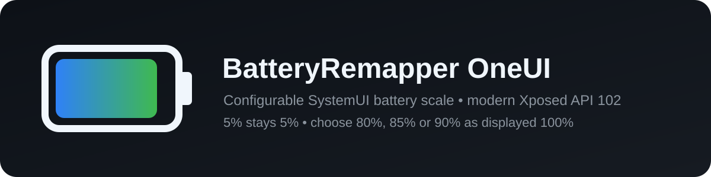

<p align="center">
  
</p>

<p align="center">
  <a href="https://github.com/igorcv88/BatteryRemapperOneUI/releases/latest"></a>
  <a href="https://github.com/igorcv88/BatteryRemapperOneUI/releases"></a>
  <a href="https://github.com/igorcv88/BatteryRemapperOneUI/stargazers"></a>
  
  
  <a href="https://github.com/igorcv88/BatteryRemapperOneUI/actions/workflows/release.yml"></a>
  <a href="LICENSE"></a>
</p>

<p align="center">
  <strong>Configurable battery-percentage remapping for Samsung One UI, implemented entirely inside SystemUI.</strong>
</p>

<p align="center">
  <a href="https://github.com/igorcv88/BatteryRemapperOneUI/releases/latest">Latest release</a>
  ·
  <a href="https://github.com/Dhangofa/BatteryRemapper">Upstream</a>
  ·
  <a href="https://modules.lsposed.org/module/com.github.dhangofa.batteryremapper/">LSPosed module page</a>
</p>

BatteryRemapper OneUI changes the battery percentage that Samsung SystemUI displays while leaving the physical battery level untouched. You can choose whether **80%**, **85%**, or **90%** physical charge should appear as **100%**. Physical values from **0% through 5% remain unchanged**, and the range between 5% and the selected upper level is stretched linearly to 100%.

The module does not change charging limits, Samsung Battery Protection, the battery HAL, kernel battery values, shutdown thresholds, or the values reported to other apps.

## Why this fork?

This repository is derived from [Dhangofa/BatteryRemapper](https://github.com/Dhangofa/BatteryRemapper), but the One UI fork now has a different mapping model and runtime architecture:

- **Configurable upper endpoint:** select 80%, 85%, or 90% physical charge as displayed 100%.
- **True low-battery anchor:** physical 0–5% is displayed unchanged, so 5% always means a real 5%.
- **Samsung SystemUI-focused scope:** only `com.android.systemui` is hooked.
- **Modern Xposed API:** migrated from the legacy Xposed entry point to libxposed API 101/102, targeting API 102.
- **Live configuration:** the selected upper endpoint is stored with Xposed remote preferences and can be changed without rebuilding the module.
- **No Battery Saver or forced-shutdown automation:** those behaviors documented by upstream are intentionally not part of this fork's current implementation.

## Battery mapping

For physical battery level `p` and selected full level `F` (`80`, `85`, or `90`), the displayed value is:

```text
p                                   when p <= 5
5 + round((p - 5) × 95 / (F - 5))   when 5 < p < F
100                                 when p >= F
```

| Physical battery | Full at 80% | Full at 85% | Full at 90% |
| ---: | ---: | ---: | ---: |
| 0% | 0% | 0% | 0% |
| 5% | 5% | 5% | 5% |
| 20% | 24% | 23% | 22% |
| 50% | 62% | 58% | 55% |
| 79% | 99% | 92% | 88% |
| 80% | 100% | 94% | 89% |
| 84% | 100% | 99% | 93% |
| 85% | 100% | 100% | 94% |
| 89% | 100% | 100% | 99% |
| 90% | 100% | 100% | 100% |

Because Android supplies integer physical percentages, some displayed numbers can be skipped. That is expected from stretching a smaller physical range into 95 display points.

## How it works

The module loads only in Samsung SystemUI and intercepts `Intent.getIntExtra(...)`. It modifies the result only when all of the following are true:

- the current process is `com.android.systemui`;
- the intent action is `android.intent.action.BATTERY_CHANGED`;
- the requested extra is `BatteryManager.EXTRA_LEVEL` (`level`).

Every unrelated `Intent.getIntExtra()` call continues through the normal chain unchanged. A duplicate-hook guard prevents the same module instance from installing the battery interceptor more than once.

The configuration app connects to the modern Xposed service and uses remote preferences. If the framework does not expose the remote-preferences capability, the controls are disabled instead of pretending that the setting was saved.

## Requirements

- Android 10 / API 29 or newer.
- A modern Xposed-compatible framework implementing libxposed API 101 or newer.
- API 102 support is recommended because this module targets API 102.
- `System UI` (`com.android.systemui`) in the module scope.

This version uses the modern `META-INF/xposed/` module format. It does not use `IXposedHookLoadPackage`, `XposedBridge`, or `assets/xposed_init`.

## Installation

1. Download the latest signed APK from [GitHub Releases](https://github.com/igorcv88/BatteryRemapperOneUI/releases/latest).
2. Install the APK.
3. Enable **BatteryRemapper OneUI** in your Xposed/LSPosed-compatible manager.
4. Ensure **System UI** (`com.android.systemui`) is in scope.
5. Restart SystemUI or reboot once after enabling the module for the first time.
6. Open BatteryRemapper OneUI and select **80%**, **85%**, or **90%**.

Changing the selected upper endpoint does not require another reboot while the Xposed service and the existing SystemUI hook remain active.

## What changes — and what does not

BatteryRemapper OneUI changes the percentage seen by Samsung SystemUI. This includes SystemUI surfaces that obtain the level through the hooked `ACTION_BATTERY_CHANGED` intent path.

It does **not** rewrite the physical battery value globally. Device Care, diagnostic apps, kernel readers and software that reads `/sys/class/power_supply/battery/capacity` directly can still show the real percentage.

It also does not enforce an 80/85/90 charging ceiling. If you want the phone to stop charging at a particular physical level, configure Samsung Battery Protection or another charging-control mechanism separately.

## Compatibility and updates

The fork is designed around Samsung One UI's SystemUI behavior. A Samsung firmware update can change how SystemUI obtains battery information. If SystemUI stops reading `BatteryManager.EXTRA_LEVEL` from `ACTION_BATTERY_CHANGED`, the hook will need to be adapted.

The module has a static Xposed scope containing only `com.android.systemui`.

## Releases

Releases are built manually from the `main` branch through the **Build APK Release** workflow. A normal push does not publish an APK and does not create a GitHub Actions artifact.

Each manual release:

1. selects the next `1.0.x` version;
2. runs unit tests and Android lint;
3. builds, aligns, signs and verifies the APK;
4. verifies the package name and generated version metadata;
5. calculates and publishes a SHA-256 file;
6. generates a changelog from merged pull requests and direct commits since the previous release;
7. publishes the APK and checksum directly under GitHub Releases.

## Building from source

The project currently uses:

- Android Gradle Plugin 9.2.1;
- Gradle 9.5.1;
- compile SDK 37;
- target SDK 34;
- Java 17;
- `io.github.libxposed:api:102.0.0`;
- `io.github.libxposed:service:102.0.0`.

A local build can be produced with:

```bash
gradle test assembleRelease \
  -PreleaseVersionCode=1 \
  -PreleaseVersionName=1.0.0
```

## Troubleshooting

**The app says the Xposed service is unavailable:** enable the module in a compatible manager/framework and make sure the framework implements modern API 101 or newer.

**The setting controls are disabled:** the connected framework does not expose the remote-preferences capability required by the configuration UI.

**SystemUI still shows the physical percentage:** confirm that `com.android.systemui` is in scope, then restart SystemUI or reboot. A firmware update may also have changed Samsung's battery reporting path.

**Another app shows a different battery percentage:** expected. The hook is scoped to SystemUI and does not replace the system-wide physical battery value.

## License and credits

BatteryRemapper OneUI is distributed under the [MIT License](LICENSE) and is derived from [Dhangofa/BatteryRemapper](https://github.com/Dhangofa/BatteryRemapper).
